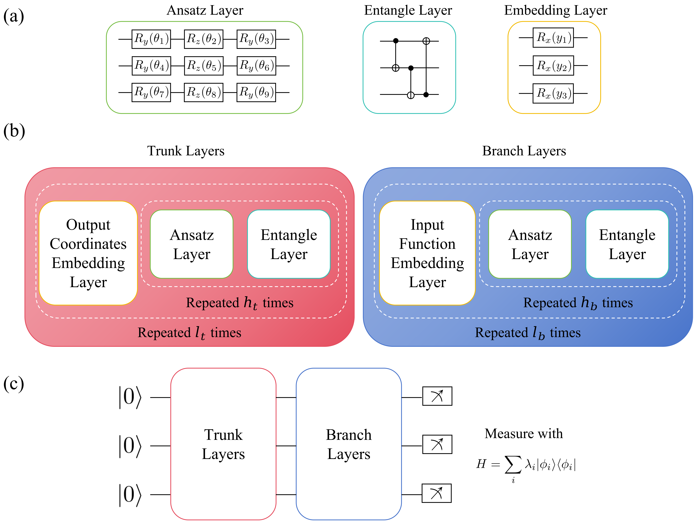

# QuanONet: Quantum Neural Operators with Adaptive Frequency Strategy

**Official Implementation**

## 📖 Introduction

**QuanONet** is a pure quantum neural operator framework designed for the NISQ era to solve partial differential equations (PDEs). Unlike hybrid architectures that rely on classical post-processing, QuanONet performs end-to-end learning within the quantum Hilbert space.

**Key Theoretical Insights:**

- **Implicit Quadratic Frame ($\mathcal{O}(p^2)$)**: We prove that the trace-based measurement protocol constructs an implicit quadratic frame from a latent dimension of $p$, strictly exceeding the representational capacity of classical linear frames ($\mathcal{O}(p)$).
- **Trainable Frequency (TF) Strategy**: By treating embedding frequencies as continuous learnable parameters, **TF-QuanONet** breaks spectral symmetries, preventing dimensional collapse and unlocking the full expressivity of the density matrix.

<p align="center">



</p>

## 📂 Project Structure

The repository is organized to handle the hybrid nature of the benchmarks (MindSpore for Quantum, PyTorch/DeepXDE for Classical):

```
.
├── configs/               # Configuration files (ODE/PDE benchmarks)
├── core/                  # Models (QuanONet, DeepONet, FNO)
├── data_utils/            # Data generators and solvers
├── dairy/                 # Training logs
├── logs/                  # Evaluation results (.json)
├── data/                  # Dataset storage (Raw simulation & Training sets)
├── train.py               # Main entry for Quantum Models (MindSpore)
├── train_dde.py           # Classical DeepONet/FNN Baseline (DeepXDE)
├── train_fno.py           # Classical FNO Baseline (DeepXDE)
└── README.md
```

## 🛠️ Installation

Since the project involves two different deep learning frameworks, please install dependencies based on the model you intend to run.

**1. For Quantum Models (TF-QuanONet)**

Requires **MindSpore** and **MindQuantum**.

```
pip install -r requirements_ms.txt
```

**2. For Classical Baselines (DeepONet, FNO)**

Requires **PyTorch** and **DeepXDE**.

```
pip install -r requirements_torch.txt
```

## 🚀 Quick Start

### 1. Train TF-QuanONet (Ours)

Train the quantum model on the Inverse ODE problem using the Trainable Frequency strategy:

```
# Uses configs/config_ODE.json by default
python train.py \
  --operator Inverse \
  --model_type QuanONet \
  --if_trainable_freq true \
  --num_qubits 5 \
  --num_epochs 100
```

### 2. Train Classical Baselines

**DeepONet:**

```
python train_dde.py \
  --operator Inverse \
  --model DeepONet \
  --net_size 3 100 3 100 \
  --num_epochs 2000
```

**FNO (Fourier Neural Operator):**

```
python train_fno.py \
  --operator Inverse \
  --net_size 16 32 3 32 \
  --num_epochs 1000
```

---

## 📊 Reproducing Paper Results

This section provides the exact commands to reproduce the experiments presented in the manuscript, categorized by the type of analysis.

### Experiment 1: General Benchmarks (Table 4)

*Comparison of different models across various ODE and PDE operators.*

You can switch the operator problem using `--operator` and the model architecture using `--model_type` (Quantum) or `--model` (Classical).

**1. ODE Benchmarks (e.g., Homogeneous Operator)**

```bash
# TF-QuanONet
python train.py --operator Homogeneous --model_type QuanONet --if_trainable_freq true
```

**2. PDE Benchmarks (e.g., Reaction-Diffusion)**

```bash
# TF-QuanONet
python train.py --operator RDiffusion --model_type QuanONet --if_trainable_freq true
```

### Experiment 2: Dimensionality Scaling Analysis (Fig. 9)

*Investigating model performance scaling with respect to the latent dimension $p$.*

Control the latent dimension by changing the number of qubits ($N$).

- $p=4$: `--num_qubits 2`
- $p=32$: `--num_qubits 5`
- $p=256$: `--num_qubits 8`

```bash
# TF-QuanONet
python train.py --operator Inverse --model_type QuanONet --if_trainable_freq true --num_qubits 2 --net_size 100 2 100 2
```

---

### Experiment 3: Hamiltonian Ablation Studies (Fig. 10 & 11)

*Analyzing the impact of spectral properties on expressivity.*

**1. Spectral Radius Control (`--ham_bound`)**

Test how the magnitude of eigenvalues affects the unitary orbit volume.

```bash
# TF-QuanONet
python train.py --operator Inverse --model_type QuanONet --if_trainable_freq true --ham_bound 10
```

**2. Pauli Basis Selection (`--ham_pauli`)**

Test invariance to the choice of Pauli operator basis.

```bash
# TF-QuanONet
python train.py --operator Inverse --model_type QuanONet --if_trainable_freq true --ham_pauli X
```

**3. Spectral Degeneracy (`--ham_diag`)**

Manually specify eigenvalues to test the effect of manifold dimension $dim(\mathcal{M}_{\Lambda})$.

```bash
# TF-QuanONet
python train.py --operator Inverse --model_type QuanONet --if_trainable_freq true --num_qubits 2 --net_size 50 2 50 2 --ham_diag -5 5 5 5
```

## ⚙️ Configuration & Parameters

All training scripts (`train.py`, `train_dde.py`, `train_fno.py`) support a unified command-line interface. Arguments are grouped by function below.

| Category             | Argument                | Description                                                                                                                                                                                                                                                                 | Default/Example  |
| :------------------- | :---------------------- | :-------------------------------------------------------------------------------------------------------------------------------------------------------------------------------------------------------------------------------------------------------------------------- | :--------------- |
| **Task Setup** | `--operator`          | **Required**. Problem type: `Inverse`, `Homogeneous`, `Nonlinear`, `RDiffusion`, `Advection`, `Darcy`.                                                                                                                                                    | -                |
|                      | `--num_points`        | **Output** resolution (number of sensor/grid points per function).                                                                                                                                                                                                    | `100`          |
|                      | `--num_points_0`      | **Input** resolution (discretization size of input function $u(x)$).                                                                                                                                                                                                | `100`          |
| **Model**      | `--model_type`        | Architecture for `train.py` (MindSpore): `QuanONet`, `HEAQNN`.                                                                                                                                                                                                        | `QuanONet`     |
|                      | `--model_type`        | Architecture for `train_dde.py` (DeepXDE): `DeepONet`, `FNN`.                                                                                                                                                                                                         | `DeepONet`     |
|                      | `--net_size`          | Network structure configuration.`<br>`• **QuanONet**: `[branch_depth, branch_ansatz_depth, trunk_depth, trunk_ansatz_depth]`• **DeepONet**: `[branch_depth, width, trunk_depth, width]<br>`• **FNO**: `[modes, width, layers, fc_hidden]` | `3 100 3 100`  |
| **Quantum**    | `--num_qubits`        | Number of qubits. Defines latent dimension$p=2^n$.                                                                                                                                                                                                                        | `5` ($p=32$) |
| *(train.py only)*  | `--if_trainable_freq` | Enable Trainable Frequency (TF) strategy (`true`/`false`).                                                                                                                                                                                                              | `false`        |
|                      | `--ham_bound`         | Hamiltonian eigenvalue range (e.g.,`[-5, 5]`).                                                                                                                                                                                                                            | `[-5, 5]`      |
| **Training**   | `--num_epochs`        | Number of training epochs (auto-converted to steps).                                                                                                                                                                                                                        | `1000`         |
|                      | `--batch_size`        | Size of mini-batches.                                                                                                                                                                                                                                                       | `100`          |
|                      | `--learning_rate`     | Initial learning rate for Adam optimizer.                                                                                                                                                                                                                                   | `0.001`        |
|                      | `--num_train`         | Number of function samples for training.                                                                                                                                                                                                                                    | `1000`         |
|                      | `--train_sample_num`  | Number of subsampled points per function for loss calculation.                                                                                                                                                                                                              | `100`          |
