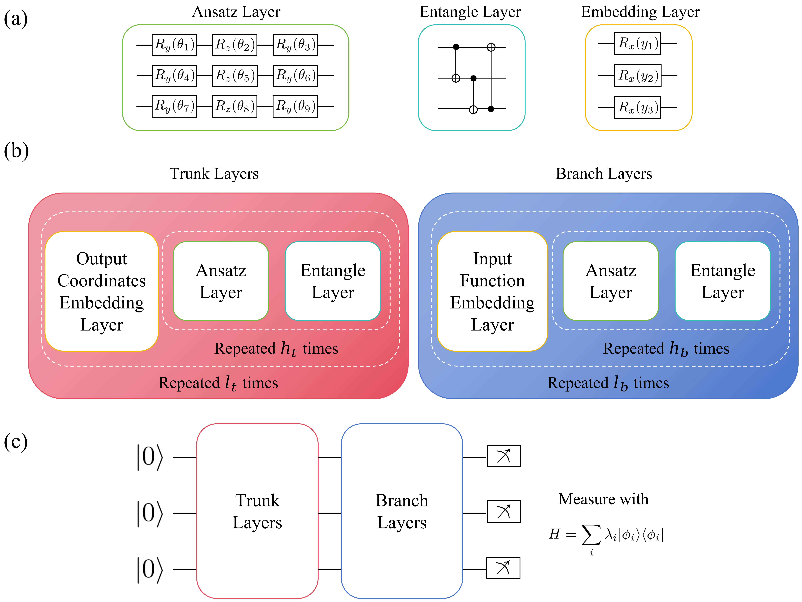

# QuanONet: Quantum Neural Operators with Adaptive Frequency Strategy

**Official Implementation**

## 📖 Introduction

**QuanONet** is a pure quantum neural operator framework designed for the NISQ era to solve partial differential equations (PDEs). Unlike hybrid architectures that rely on classical post-processing, QuanONet performs end-to-end learning within the quantum Hilbert space.

**Key Theoretical Insights:**

- **Implicit Quadratic Frame ($\mathcal{O}(p^2)$)**: We prove that the trace-based measurement protocol constructs an implicit quadratic frame from a latent dimension of $p$, strictly exceeding the representational capacity of classical linear frames ($\mathcal{O}(p)$).
- **Trainable Frequency (TF) Strategy**: By treating embedding frequencies as continuous learnable parameters, **TF-QuanONet** breaks spectral symmetries, preventing dimensional collapse and unlocking the full expressivity of the density matrix.

<p align="center">

</p>

## 📂 Project Structure

The repository adopts a unified solver architecture handling both Quantum (MindSpore) and Classical (PyTorch/DeepXDE) backends:

```text
.
├── main.py                # Unified Entry Point (Auto-backend selection)
├── convert_ckpt.py        # Converts MindSpore .ckpt to .npz for hardware inference
├── requirements.txt       # Project dependencies
├── README.md              # Project documentation
├── .gitignore             # Git ignore rules
│
├── scripts/               # Automated reproduction bash scripts
│   ├── reproduce_table4.sh  # General Benchmarks (ODE & PDE)
│   ├── reproduce_table5.sh  # Asymmetric Parameterization (vs. FNO)
│   ├── reproduce_table7.sh  # Implicit Frame Capacity Search
│   ├── reproduce_table8.sh  # Circuit Architecture Ablation
│   └── reproduce_sec54.sh   # Hamiltonian Design Ablation
│
├── core/                  # Core model architectures
│   ├── models.py            # Unified model wrapper
│   ├── quantum_circuits.py  # QuanONet & HEAQNN circuits (MindSpore)
│   ├── dde_models.py        # Classical baselines (DeepONet, FNO, FNN)
│   └── layers.py            # Custom neural network layers
│
├── solvers/               # Training & Evaluation solvers
│   ├── solver_ms.py         # Quantum solver (MindSpore backend)
│   └── solver_dde.py        # Classical solver (DeepXDE/PyTorch backend)
│
├── data_utils/            # Data pipelines and generation
│   ├── PDE_SYSTEMS.py       # Definitions of physical operators (Antideriv, Darcy, etc.)
│   ├── data_generation.py   # Dataset generation scripts
│   ├── data_manager.py      # Data loading, formatting, and batching
│   └── random_func.py       # Gaussian Random Field (GRF) generators
│
├── utils/                 # Utilities and helpers
│   ├── common.py            # Argument parsing (hyperparameters)
│   ├── logger.py            # Unified logging, tracking, and JSON saving
│   ├── metrics.py           # Evaluation metrics computation (L2, MSE)
│   └── backend.py           # Hardware backend management
│
├── hardware_deployment/        # Real-device deployment on IBM Quantum
│   ├── requirements_qiskit.txt # Standalone Qiskit environment dependencies
│   ├── 1_backend_analysis.py   # Physical chip topology and gate fidelity analysis
│   ├── 2_ibm_inference.py      # Transpilation, execution, and plotting
│   └── best_Antideriv_QuanONet_Net5-1-5-1_Q2_TF_S0.01_1000x100_Seed0.npz # Pre-trained weights
│
├── configs/               # Configuration presets
└── image/                 # Architectural diagrams (qon_circ2.png, tf.png)

```

## 🛠️ Installation

The project requires **MindSpore** (for Quantum models) and **PyTorch** + **DeepXDE** (for Classical baselines).

```bash
pip install -r requirements.txt
```

## 🚀 Quick Start

All models are trained using the unified `main.py` entry point.

### **Note on Datasets 💡** 

You do not need to download or manually generate any datasets. The framework features an **on-the-fly data generation** pipeline. Upon the first run of any task, the system will automatically generate the corresponding Gaussian Random Field (GRF) data, solve the equations, and cache the `.npz` files locally for future use.

### Smart Device Selection 🤖

You don't need to manually specify the device. The system automatically assigns:

* **Quantum Models (QuanONet/HEAQNN)**: Run on **CPU** (default) to save GPU resources.
* **Classical Models (DeepONet/FNN/FNO)**: Run on **GPU** (if available).

To force a specific GPU, use `--gpu <ID>`.

### 1. Train TF-QuanONet (Ours)

Train the quantum model on the Antiderivative ODE problem using the Trainable Frequency strategy:

```bash
python main.py \
  --operator Antideriv \
  --model_type QuanONet \
  --if_trainable_freq true \
  --num_qubits 5 \
  --num_epochs 1000

```

### 2. Train Classical Baseline (DeepONet)

Train a DeepONet with asymmetric Branch/Trunk widths (automatically handled):

```bash
# Branch: 100 width, Trunk: 100 width
python main.py \
  --operator Antideriv \
  --model_type DeepONet \
  --net_size 3 100 3 100 \
  --num_epochs 2000

```

---

## 📊 Reproducing Paper Results

We provide automated bash scripts in the `scripts/` directory to reproduce the experiments presented in the manuscript.

### Usage

```bash
# Run on default devices (Quantum->CPU, Classical->GPU)
./scripts/script_name.sh
```

### Available Experiments

We provide automated bash scripts in the `scripts/` directory to reproduce the experimental results reported in the manuscript.

| Script                            | Description                                                                                                                                                                                                                                                                             | Relevant Table/Sec                       |
| :-------------------------------- | :-------------------------------------------------------------------------------------------------------------------------------------------------------------------------------------------------------------------------------------------------------------------------------------- | :--------------------------------------- |
| **`reproduce_table4.sh`** | **General Benchmarks**: Comprehensive comparison of **TF-QuanONet** against Quantum (HEA, TF-HEA) and Classical (DeepONet, FNN) baselines across 6 operator learning tasks (ODEs: Antiderivative, Homogeneous, Nonlinear; PDEs: Diffusion-Reaction, Advection, Darcy).      | **Table 4**`<br>`(Sec 5.2.2)     |
| **`reproduce_table5.sh`** | **Asymmetric Parameterization & FNO**: Evaluates model performance under a constrained parameter budget (~1.2k params). Compares compact TF-QuanONet against over-parameterized **FNO** and **DeepONet** (~10k params) to highlight quantum parameter efficiency.     | **Table 5 & 6**`<br>`(Sec 5.2.3) |
| **`reproduce_table7.sh`** | **Implicit Frame Capacity (Architecture Search)**: Grid search for TF-QuanONet (varying $h_b, h_t$) and DeepONet (varying Depth/Width). Demonstrates that QuanONet avoids the error saturation observed in classical models, verifying the $\mathcal{O}(p^2)$ implicit frame. | **Table 7**`<br>`(Sec 5.3.1)     |
| **`reproduce_fig9_scaling.sh`** | **High-Dimensional Scaling Limit**: Sweeps the latent dimension $p$ from 4 to 256 (2 to 8 qubits). Demonstrates that TF-QuanONet robustly converges to the intrinsic error floor. | **Fig 9**`<br>`(Sec 5.3.1) |
| **`reproduce_table8.sh`** | **Circuit Architecture Ablation**: Investigates the trade-off between **Circuit Width** (Qubits $p \in \{2, 5, 10\}$) and **Depth**. Analyzes how increasing qubit count impacts expressivity vs. trainability (barren plateaus).                                   | **Table 8**`<br>`(Sec 5.3.2)     |
| **`reproduce_sec54.sh`**  | **Hamiltonian Ablation**: Evaluates the impact of Hamiltonian design on model expressivity, sweeping over Pauli basis choices, spectral radii (bounds), and exact spectral degeneracies.                                                                                          | **Fig 10 & 11**`<br>`(Sec 5.4)   |

---

## ⚙️ Configuration & Parameters

The `main.py` script supports the following arguments:

### 1. Task & Data Setup

| Argument                         | Description                                                                                           | Default                        |
| -------------------------------- | ----------------------------------------------------------------------------------------------------- | ------------------------------ |
| `--operator`                   | Problem type:`Antideriv`, `Homogeneous`, `Nonlinear`, `RDiffusion`, `Advection`, `Darcy`. | **Required**             |
| `--num_train` / `--num_test` | Number of function samples for training/testing.                                                      | `1000` / `1000`            |
| `--train_sample_num`           | Points sampled per function for training ().                                                          | `10`                         |
| `--test_sample_num`            | Points sampled per function for testing ().                                                           | `100`                        |
| `--num_points`                 | **Output** resolution (Trunk/Target grid size).                                                 | `100`                        |
| `--num_points_0`               | **Input** resolution (Branch/Source function size).                                             | `100` (PDE) / `1000` (ODE) |
| `--num_cal`                    | **High-Fidelity Resolution** for data generation (Ground Truth).                                | `1000` (ODE) / `100` (PDE) |
| `--seed`                       | Random seed for reproducibility.                                                                      | `0`                          |

### 2. Model Architecture (`--net_size`)

| Model              | Format                                                                                             | Example                              |
| :----------------- | :------------------------------------------------------------------------------------------------- | :----------------------------------- |
| **QuanONet** | `[b_depth, b_ansatz, t_depth, t_ansatz]`                                                         | `20 2 10 2`                        |
| **DeepONet** | `[b_depth, b_width, t_depth, t_width]` `<br>` *Optional 5th arg for output dim:* `[... p]` | `3 100 3 100<br>``3 100 3 50 10` |
| **FNO**      | `[modes, width, layers, fc_hidden]`                                                              | `16 32 3 32`                       |

### 3. Quantum Specifics

| Argument                | Description                                                                                                                                                               | Default     |
| :---------------------- | :------------------------------------------------------------------------------------------------------------------------------------------------------------------------ | :---------- |
| `--num_qubits`        | Number of qubits. Defines latent dimension$p=2^n$.                                                                                                                      | `5`       |
| `--if_trainable_freq` | Enable Trainable Frequency (TF) strategy (`true`/`false`).                                                                                                            | `false`   |
| `--scale_coeff`       | Scaling coefficient for encoding.                                                                                                                                         | `0.01`    |
| `--ham_bound`         | Hamiltonian eigenvalue range (e.g.,`-5 5` for $[-5, 5]$).                                                                                                             | `[-5, 5]` |
| `--ham_pauli`         | Pauli basis for the Hamiltonian (`X`, `Y`, or `Z`).                                                                                                                 | `Z`       |
| `--ham_diag`          | Manually specify exact eigenvalues (e.g.,`-5 5 5 5`). `<br>` **Note**: If provided, this strictly **overrides** both `--ham_bound` and `--ham_pauli`. | `None`    |

### 4. Training & System

| Argument            | Description                                                            | Default         |
| ------------------- | ---------------------------------------------------------------------- | --------------- |
| `--batch_size`    | Size of mini-batches.                                                  | `100`         |
| `--learning_rate` | Initial learning rate.                                                 | `0.0001`      |
| `--num_epochs`    | Number of training epochs.                                             | `1000`        |
| `--gpu`           | GPU ID (e.g.,`0`). If unspecified, uses **Smart Auto-Select**. | `None` (Auto) |
| `--prefix`        | Prefix for output directories (logs/checkpoints).                      | `None`        |

## 🖥️ Real-Device Deployment on IBM Quantum

The folder `hardware_deployment/` contains the scripts used to deploy and evaluate **QuanONet** on real superconducting quantum processors (e.g., `ibm_fez`, `ibm_torino`), as reported in **Section 5.5** of our manuscript.

Due to potential dependency conflicts between different quantum frameworks, we provide a standalone environment for real-device inference using Qiskit.

### 1.Setup

1. Create a fresh virtual environment and install the required packages:

```bash
pip install -r requirements_qiskit.txt
```

### 2.Workflow & Execution

We have integrated the hardware profiling and inference pipeline into a single unified script: **`ibm_inference.py`**.

This script automatically scans the physical coupling map of the IBM backend, evaluates T1/T2 relaxation times and ECR/CZ gate fidelities to route the optimal physical qubits. It then constructs the logical QuanONet circuit, transpiles it, and plots the results.

You can run the deployment in three different modes:

#### Mode 1: Ideal Simulation

To verify the circuit construction and logical depth locally without connecting to IBM servers:

```bash
# Ensure QISKIT_IBM_TOKEN is not set in this terminal session
python ibm_inference.py
```

#### Mode 2: Real Hardware Execution

To automatically find the least busy IBM Quantum backend, perform hardware profiling, transpile the circuit, and submit a new job to the noisy QPU:

```bash
# Ensure QISKIT_IBM_TOKEN is exported
export QISKIT_IBM_TOKEN="your_token_here"
python ibm_inference.py
```

*(Note: This mode may require waiting in the IBM Quantum queue. A Job ID will be printed in your terminal.)*

#### Mode 3: Fetch Existing Job Results

To bypass the long IBM Quantum queue times and instantly generate the comparison plot using a previously completed job:

```bash
python ibm_inference.py --job_id <YOUR_JOB_ID_HERE>
```

We have included a pre-trained weight file (`best_Antideriv_QuanONet_Net5-1-5-1_Q2_TF_S0.001_1000x100_Seed0.npz`) that matches the lightweight hardware configuration (2 qubits, m=10, depth=5) for quick reproduction. If you wish to evaluate your own newly trained models on real hardware, please follow these steps:

1. **Convert Weights:** Use the `convert_ckpt.py` script provided in the repository's root directory to convert your MindSpore `.ckpt` checkpoint into an `.npz` file.
2. **Run Inference:** Execute the script and specify your custom weight path via the command line:

```bash
python ibm_inference.py --weight_path YOUR_WEIGHT_FILE.npz
```

1. **Architecture Parsing:** The script is designed to automatically parse the network dimensions if your filename follows our default convention (e.g., containing `Net[branch]-[hidden]-[trunk]-[hidden]_Q[qubits]`). If your custom file does not follow this naming rule, you **must** manually specify the architecture using the following arguments:

```bash
python ibm_inference.py --weight_path custom.npz --n_qubits 4 --n_branch 5 --n_trunk 5 --n_hidden 1
```
